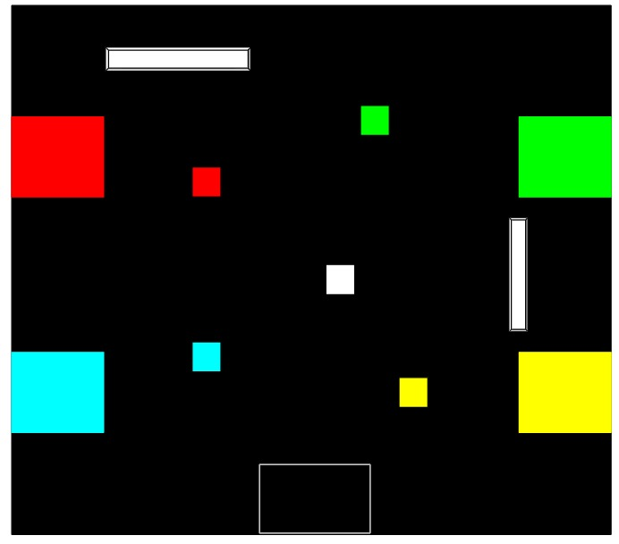

# IESL RoboGames Final

This project involves controlling a Kobuki robot to autonomously pick up colored boxes and place them in their designated target locations within an arena. The robot uses computer vision to detect boxes and targets, and it follows a predefined sequence of colors to complete the task.

## Features

- **Color Detection**: The robot identifies boxes and targets based on their colors using YOLOv8 and HSV color classification.
- **Autonomous Navigation**: The robot moves towards the detected boxes and targets, adjusting its position based on pixel distance.
- **Box Placement**: The robot places the boxes in their respective target locations.
- **Sequence Handling**: The robot processes boxes in a predefined sequence of colors.

## Project Structure

```
.
├── cam_feed.py          # Handles camera input and frame updates
├── yolov8_model.py      # YOLOv8 model and color detection logic
├── roboMove.py          # Main script for running the Kobuki robot
├── model/               # custom trained YOLOv8 models and notebooks to train the model
├── testingCodes/        # Contains test scripts for robot movements
└── requirements.txt     # Python dependencies
```

## How It Works

1. **Initialization**:
   - The robot initializes its camera and YOLOv8 model.
   - The sequence of colors to process is defined in `colorArray`.

2. **Box Detection**:
   - The robot scans the arena for boxes using the `search_box` function in [`yolov8_model.py`](yolov8_model.py).
   - It identifies the box color and determines its position relative to the robot.

3. **Navigation to Box**:
   - The robot moves towards the detected box using the `moveToBox` function in [`roboMove.py`](roboMove.py).
   - It adjusts its direction based on the pixel distance of the box from the center of the camera frame.

4. **Target Detection**:
   - After grabbing a box, the robot searches for the corresponding target location using the `find_target` function in [`yolov8_model.py`](yolov8_model.py).

5. **Box Placement**:
   - The robot places the box at the target location using the `place_Box` function in [`roboMove.py`](roboMove.py).

6. **Repeat**:
   - The robot repeats the process for the next color in the sequence until all boxes are placed.

## Prerequisites

- Python 3.10(recommended) or higher
- A Kobuki robot
- A camera compatible with OpenCV
- Pre-trained YOLOv8 model (`robogames_v2.pt`)

## Installation

1. Clone the repository:
   ```bash
   git clone https://github.com/dilshan-49/Robogames-Final.git
   cd robogames-final
   ```

2. Install dependencies:
   ```bash
   pip install -r requirements.txt
   ```

3. Place the trained YOLOv8 model in the `model/` directory.

## Usage

1. Run the main script to start the robot:
   ```bash
   python roboMove.py
   ```

2. The robot will autonomously detect, pick up, and place boxes in the target locations based on the sequence defined in `colorArray`.

## Arena Layout

The arena consists of:
- Colored boxes (Red, Green, Blue, Yellow) scattered in random positions.
- Target areas for each color, marked with the same color.



## Notes

- Ensure the arena is well-lit for accurate color detection.
- The robot's camera should be calibrated for the specific environment.

## Contributers
 - Shehan Perera - [Github](https://github.com/ShehanPer)
 - Dhawala Rajakaruna - [Github](https://github.com/DhawalaRajakaruna)

## Acknowledgments

- [Ultralytics YOLOv8](https://github.com/ultralytics/ultralytics) for object detection.
- Kobuki robot for providing a robust platform for autonomous navigation.

## License

This project is licensed under the MIT License. See the `LICENSE` file for details.
